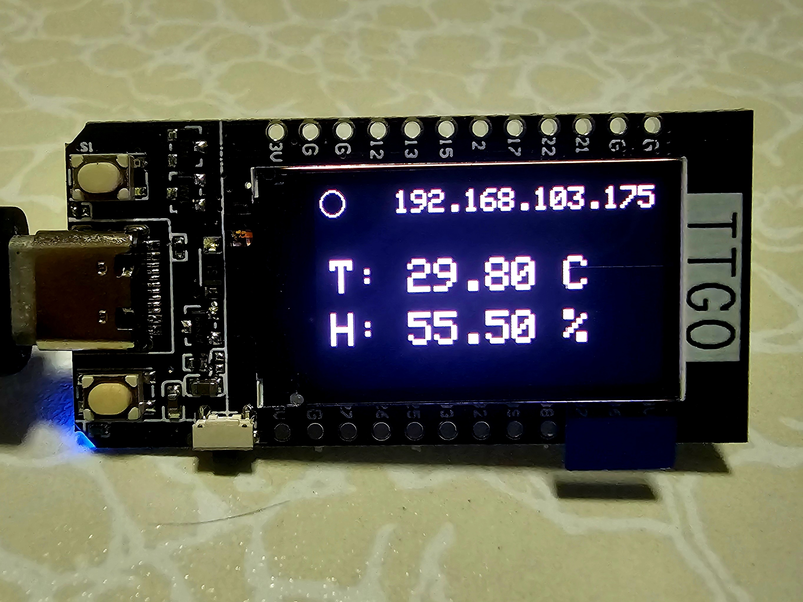
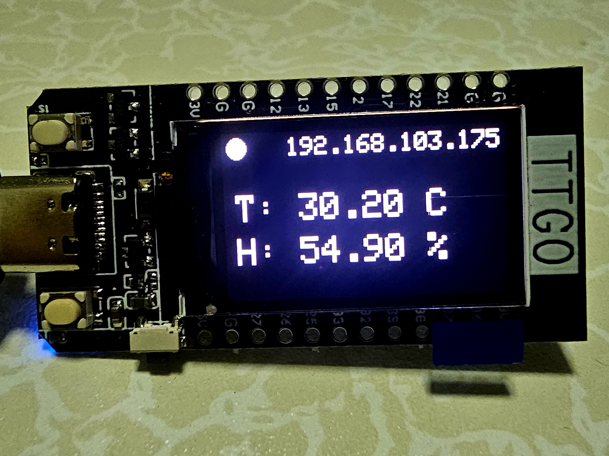

# Rest Weather Sensor Node — AI Regeneration Prompt

> **Purpose:** This document is a complete specification. Paste it into any generative AI and ask it to produce a single `src/main.cpp` file for a PlatformIO / Arduino project targeting the LilyGO T-Display (ESP32).

---

## Prompt to use

```
Using the specification below, write a single C++ file (src/main.cpp) for a
PlatformIO Arduino project. Do not split into headers or multiple files.
```

---

## Hardware

| Component     | Detail                                              |
|---------------|-----------------------------------------------------|
| Board         | LilyGO T-Display (ESP32)                           |
| Sensor        | DHT22 — temperature & humidity                      |
| Sensor pin    | GPIO 12 (DATA), 3.3 V, GND, 4.7 kΩ pull-up        |
| Display       | Built-in ST7789 TFT, 240 × 135 px                  |
| Backlight pin | GPIO 4 (PWM)                                        |

---

## PlatformIO configuration (`platformio.ini`)

```ini
[env:lilygo-t-display]
platform = espressif32
board = lilygo-t-display
framework = arduino
lib_deps =
    adafruit/DHT sensor library
    adafruit/Adafruit Unified Sensor
    bodmer/TFT_eSPI
build_flags =
    -DUSER_SETUP_LOADED=1
    -DST7789_DRIVER=1
    -DTFT_WIDTH=135
    -DTFT_HEIGHT=240
    -DCGRAM_OFFSET=1
    -DTFT_MOSI=19
    -DTFT_SCLK=18
    -DTFT_CS=5
    -DTFT_DC=16
    -DTFT_RST=23
    -DTFT_BL=4
    -DTFT_BACKLIGHT_ON=1
    -DLOAD_GLCD=1
    -DLOAD_FONT2=1
    -DLOAD_FONT4=1
    -DLOAD_FONT6=1
    -DLOAD_FONT7=1
    -DLOAD_GFXFF=1
    -DSMOOTH_FONT=1
    -DSPI_FREQUENCY=40000000
```

---

## Required includes

```cpp
#include <Arduino.h>
#include <DHT.h>
#include <TFT_eSPI.h>
#include <WiFi.h>
#include <HTTPClient.h>
#include <WiFiClientSecure.h>
```

---

## Configuration macros

```cpp
#define DHT_PIN   12
#define DHT_TYPE  DHT22
#define DEVICE_ID 1

#define WIFI_SSID "<ssid>"
#define WIFI_PASS "<pass>"
#define API_URL   "https://<mock-api-url>/api/devices"
```

---

## Display layout

- Rotation: 3 (landscape, USB port on the right)
- Background: black, text: white

```
+------------------------------------------+
| (●)  indicator          192.168.x.x       |  ← size 2, right-aligned at x=235, y=5
|                                           |
|      T: 28.50 C                           |  ← size 3, cursor x=10, y=50
|      H: 63.20 %                           |  ← size 3, cursor x=10, y=85
+------------------------------------------+
```

| Element              | Position                        | Text size |
|----------------------|---------------------------------|-----------|
| Activity indicator   | top-left circle (12, 12) r=8    | —         |
| IP address           | top-right, datum TR, x=235, y=5 | 2         |
| Temperature          | x=10, y=50, `"T: %.2f C"`       | 3         |
| Humidity             | x=10, y=85, `"H: %.2f %%"`      | 3         |

### Activity indicator states

- **Idle:** `drawCircle` outline only (fill black first to erase)
- **Sending:** `fillCircle` white

---

## Backlight

Use `ledcSetup` / `ledcAttachPin` / `ledcWrite` (Arduino ESP32 PWM API):

```cpp
ledcSetup(0, 5000, 8);   // channel 0, 5 kHz, 8-bit
ledcAttachPin(4, 0);     // GPIO 4 → channel 0
ledcWrite(0, 100);       // ~40% brightness (100/255)
```

---

## WiFi

- Call `WiFi.begin(SSID, PASS)` and block in a loop until `WL_CONNECTED`.
- While waiting, show `"Connecting WiFi"` on screen (text size 2, cursor 10, 60).
- `connectWiFi()` must guard against calling again if already connected.
- Call `connectWiFi()` at the top of every `loop()` iteration to auto-reconnect.

---

## API call (`sendData`)

| Item         | Detail                                           |
|--------------|--------------------------------------------------|
| Method       | PUT                                              |
| URL          | `API_URL + "/" + DEVICE_ID`                      |
| Content-Type | `application/json`                               |
| Body         | `{"temp":<2dp>,"humid":<2dp>}`                   |
| Interval     | Every 10 000 ms (tracked with `millis()`)        |
| TLS          | `WiFiClientSecure` with `setInsecure()`          |

Fill the indicator circle before the PUT, clear it (outline) after.

---

## Loop behavior

1. `connectWiFi()` — reconnect if dropped
2. Read sensor values (see stub note below)
3. If `millis() - lastSendTime >= 10000` → `sendData(temp, humid)`, update `lastSendTime`
4. `fillScreen(TFT_BLACK)`
5. `drawIndicator(false)` — outline
6. Draw IP address (top-right, text size 2)
7. If sensor values are `NaN` → print `"Sensor Error"` (text size 2, cursor 10, 60)
8. Else → print temperature (size 3, y=50) and humidity (size 3, y=85)
9. `delay(2000)`

---

## Stub sensor values (for testing without hardware)

The real DHT22 reads are commented out; replace with random values during development:

```cpp
// float humidity    = dht.readHumidity();
// float temperature = dht.readTemperature();
float humidity    = random(500, 701) / 10.0;  // 50.0–70.0
float temperature = random(250, 351) / 10.0;  // 25.0–35.0
```

When the sensor is physically connected, uncomment the `dht` lines and remove the `random` lines.

---

## Photos

Idle state  


Sending state  

